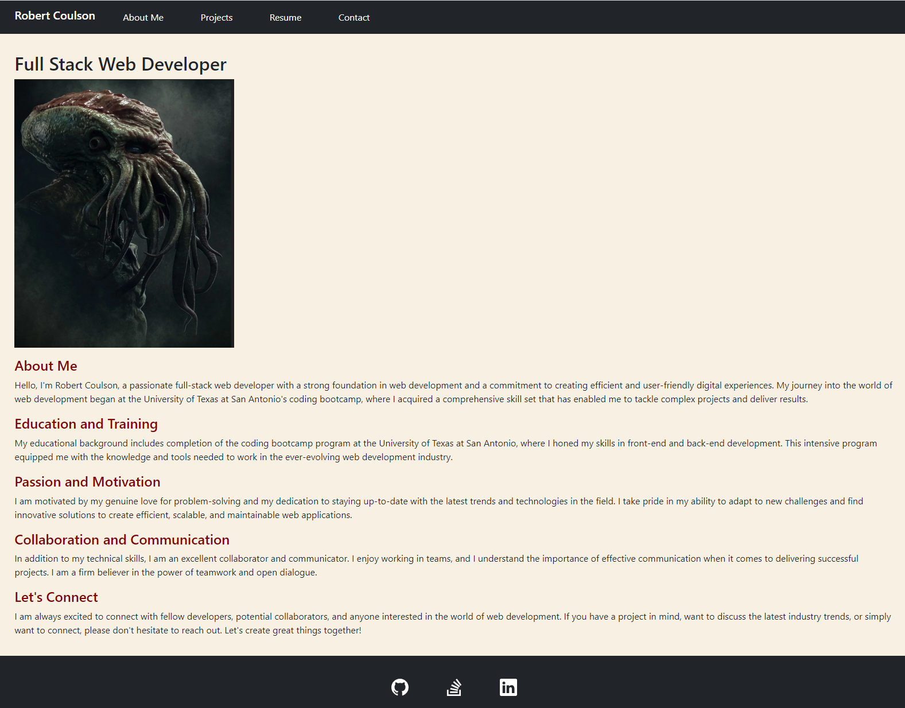

# React-Portfolio

## Table of Contents
- [Description](#description)
- [Technology](#technology)
- [Installation](#installation)
- [Features](#features)
- [License](#license)
- [Contribution](#contribution)
- [Questions](#questions)

### Description

Welcome to my personal portfolio project! This website showcases my skills, experience, and projects in a sleek and interactive manner, all powered by React and Vite. Whether you're a potential employer, collaborator, or just curious about what I do, you've come to the right place!

### Technologies

Node.js, Express.js, IndexedDB, React, Vite, Netlify, Bootstrap

### Installation

1. Clone this repository to your local machine.
2. Navigate to the project directory
3. Run the following commands in your terminal
```sh
npm install
npm run dev
```
4. Open your browser and visit `http://localhost:3000` to see the portfolio in action.

### Features

* Responsive Design: My portfolio is optimized for all devices, ensuring a seamless user experience on desktops, tablets, and mobile phones.

* Project Showcase: View detailed information about my projects, including descriptions, technologies used, and live demos.

* Interactive Resume: Get to know me better by exploring my resume, education, and work experience in an interactive way.

## Netlify Deployment


## ScreenShot



### License

[](LICENSE)

### Questions

If you have any questions feel free to contact me via email: robertcoulson91@gmail.com 
You can also view more of my projects at https://github.com/RobertC91.